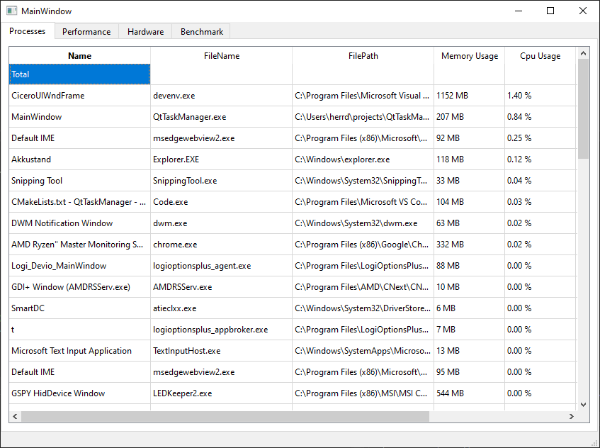
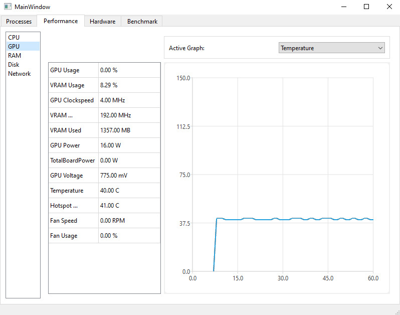

# QtTaskManager

Monitors system information such as running processes, current performance (cpu, gpu, memory)
or hardware and driver information.

## Dependencies

### submodules
ADLX : https://github.com/GPUOpen-LibrariesAndSDKs/ADLX
AGS_SDK : https://github.com/GPUOpen-LibrariesAndSDKs/AGS_SDK
nvapi : https://github.com/NVIDIA/nvapi

optional:
RyzenMasterMonitoringSDK : https://www.amd.com/de/developer/ryzen-master-monitoring-sdk.html

### todo

- move WmiManager to seperate Worker (non cpu stuff out of CpuInfo)
- update network speed graph
- test nvapi code